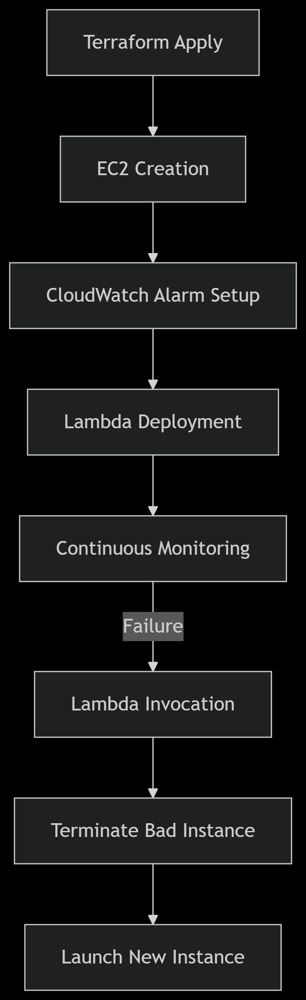

💥 IronMan EC2: Auto-Healing EC2 Infrastructure with Terraform, Lambda, and CloudWatch
What would Tony Stark do if his EC2 crashed?
He’d build one that replaces itself — because heroes don’t log in to restart things manually.

This repo showcases:

🚀 EC2 launch with Terraform

🧠 CloudWatch + Lambda auto-recovery on failure

🪝 Slack alerts to show you’ve got control

🌐 Elastic IP persistence because IP changes are for rookies

"I am... infrastructure as code." – Me, pretending to be Iron Man

> Because rebooting EC2s manually is for peasants.

A fully automated, self-healing EC2 setup using **Terraform**, **CloudWatch**, **SNS**, and **Lambda**.  
Inspired by Iron Man’s ability to auto-deploy suits mid-battle, this project replaces any failed EC2 instance with a fresh one — no human intervention required.

---

## ⚙️ Tech Stack


---

## 🧠 Features

- Auto-deploy EC2 via Terraform
- Detect instance failure with CloudWatch
- Send alerts via SNS
- Trigger Lambda to terminate & relaunch instance
- Optional: retain Elastic IP to maintain consistency
- Bonus: Slack alert integration (not included but encouraged)

---

## 🖼 Architecture Diagram



---

## 🛠 Setup Instructions

1. Clone the repo
2. Edit `terraform/variables.tf` for your region & key pair
3. Deploy with:
   ```bash
   cd aws-autohealing-ec2/lambda/
   zip lambda.zip index.js
   mv lambda.zip ../terraform/
   cd terraform 
   terraform init
   terraform apply
